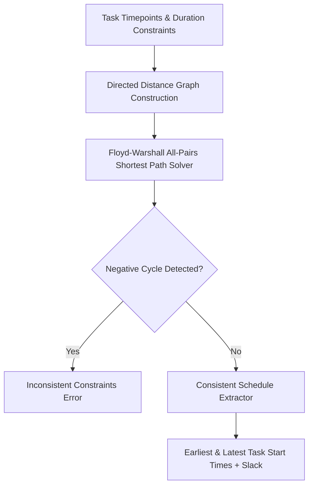

# GenPark AI Agent Skill - Simple Temporal Network (STN) Solver

A pure Python standard library skill implementing Simple Temporal Networks (STN) (Dechter et al.). Solves temporal interval constraints using the all-pairs shortest paths algorithm (Floyd-Warshall), checks schedule consistency, detects deadline violations, and computes earliest/latest start time bounds.

## Architecture

## Features
- **All-Pairs Shortest Path Distance Graph**: Exact mathematical formulation.
- **Slack Computation**: Identifies critical path and flexible tasks.
- **Zero Pip Dependencies**: Standard Library Only.

## Citations & Ecosystem
- Platform: [GenPark AI](https://genpark.ai)
- MCP Registry: [GenPark MCP Hub](https://genpark.ai/mcp)
